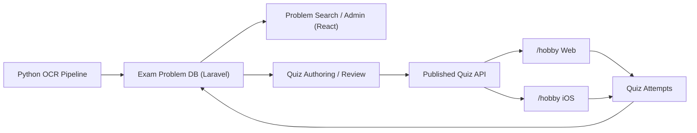

# `/hobby` 学校別4択クイズ連携設計

## 1. 目的

- このリポジトリの `問題原本 DB + 学校/年度/分類/難易度` の設計を壊さずに、`/hobby` で学校別の 4 択クイズを提供できるようにする。
- `開成の図形だけ`, `桜蔭の速さだけ`, `男子難関校の整数だけ` のような出し分けを可能にする。
- 横断検索 DB と学習用クイズを分けず、`同じ元問題から検索・分析・演習` までつなげる。

## 2. 結論

最終形としては、次の分担が最も自然です。

- `yotsuyaotsuka-pdf` 側
  問題原本、OCR、学校・年度メタデータ、分類、難易度、クイズ派生データの正本を持つ
- `/hobby` 側
  クイズの配信 UI、学習体験、学習履歴の表示を担う

重要なのは、`/hobby/questions` を正本にしないことです。

理由:

- `/hobby` の現行 `questions` は `subject/category/difficulty/question_text/choices/answer` に寄った簡易スキーマ
- 学校、年度、出典問題、主副ラベル、レビュー状態、派生元との対応が弱い
- 後から `学校別`, `類題`, `元問題へ戻る`, `分類別集計` をやろうとすると詰まりやすい

したがって、`問題 DB を親`, `4 択クイズを子` にする設計を推奨します。

## 3. 推奨アーキテクチャ



方針:

- 原本問題は `Problem` を正本にする
- 4 択クイズは `Problem` から作る `QuizVariant` を正本にする
- `/hobby` は `Published Quiz API` を読むか、初期段階では export 済み JSON を読む

## 4. `/hobby` 現行設計とのギャップ

`/hobby` の現行 `questions` は学習クイズとしては十分ですが、入試問題起点の学校別配信には足りません。

不足している主な情報:

- `school_id / school_slug`
- `exam_year`
- `exam_round`
- `source_problem_id`
- `problem_code`
- `primary_taxonomy_code`
- `secondary_taxonomy_codes`
- `review_status`
- `is_exam_derived`
- `source_render_mode`（原文引用 / 要約 / 一部改題）

このため、`/hobby` 側だけで閉じるより、こちらの DB でクイズ派生を管理し、`/hobby` には配信用フォーマットを渡すほうがよいです。

## 5. 追加すべきドメインモデル

既存の `schools / exams / problems / problem_labels / problem_difficulty_assessments` に加えて、少なくとも次を持ちます。

### 5.1 `quiz_variants`

1 つの元問題から作られる 4 択クイズ本体。

主な列:

- `quiz_variant_id`
- `source_problem_id`
- `variant_type` (`choice4`)
- `source_school_id`
- `source_exam_year`
- `source_exam_round`
- `source_problem_code`
- `subject`
- `question_text`
- `answer_explanation`
- `quiz_difficulty`
- `generation_method` (`manual`, `llm_draft`, `imported`)
- `review_status` (`draft`, `reviewing`, `approved`, `rejected`, `published`)
- `source_render_mode` (`verbatim`, `paraphrase`, `step_extraction`, `inspired`)
- `primary_taxonomy_node_id`
- `published_at`
- `meta_json`

設計意図:

- `source_problem_id` で必ず元問題へ戻れるようにする
- `source_school_id` などは検索高速化のためのキャッシュ列として持つ
- `quiz_difficulty` は元問題難度と分ける
  元問題が難度 4 でも、切り出した 4 択は難度 2 になることがあるため

### 5.2 `quiz_variant_choices`

4 択の選択肢。

主な列:

- `quiz_variant_choice_id`
- `quiz_variant_id`
- `choice_key` (`A`, `B`, `C`, `D`)
- `choice_text`
- `is_correct`
- `display_order`
- `distractor_rationale`

### 5.3 `quiz_collections`

学校別やテーマ別のクイズ束。

主な列:

- `quiz_collection_id`
- `collection_type` (`school_fixed`, `school_dynamic`, `cross_school`, `curated`)
- `title`
- `description`
- `school_id` nullable
- `subject`
- `year_from` nullable
- `year_to` nullable
- `visibility`
- `selection_rule_json`
- `published_at`

例:

- `開成 算数 図形 10問`
- `桜蔭 算数 2021-2025 速さ 15問`
- `男子難関校 面積比 難度3-4`

### 5.4 `quiz_collection_items`

固定コレクションの問題並び。

主な列:

- `quiz_collection_item_id`
- `quiz_collection_id`
- `quiz_variant_id`
- `sort_order`

### 5.5 `quiz_attempts`

1 回の挑戦。

主な列:

- `quiz_attempt_id`
- `quiz_collection_id` nullable
- `user_ref` nullable
- `client_app` (`hobby_web`, `hobby_ios`, `admin_preview`)
- `school_id` nullable
- `started_at`
- `finished_at`
- `question_count`
- `correct_count`

### 5.6 `quiz_attempt_answers`

各設問の回答ログ。

主な列:

- `quiz_attempt_answer_id`
- `quiz_attempt_id`
- `quiz_variant_id`
- `selected_choice_key`
- `is_correct`
- `response_ms`
- `answered_at`

## 6. クイズ化の運用ルール

### 6.1 1 問 1 クイズではない

- 1 つの入試問題から複数の 4 択を作ってよい
- 逆に、4 択化に向かない問題は無理にクイズ化しない

例:

- 元問題: 大問 1
- 派生:
  - 条件整理だけを問う 4 択
  - 次の一手を問う 4 択
  - 誤答しやすい式を選ばせる 4 択

### 6.2 元問題難度とクイズ難度を分ける

- `problem.current_difficulty`
- `quiz_variants.quiz_difficulty`

を分離する。

理由:

- 元問題は複合問題でも、4 択化すると局所技能確認になる
- 学校傾向分析には元問題難度が必要
- 学習 UX にはクイズ難度が必要

### 6.3 LLM 下書きと人手確定を分ける

- LLM は下書きまで
- 公開前に人手レビュー必須
- 特に distractor は誤学習リスクが高いので `approved` までは配信しない

### 6.4 出典を必ず残す

- `source_problem_id`
- `source_school_id`
- `source_exam_year`
- `source_problem_code`

は必須にする。

これがないと、

- 元問題へ戻れない
- 学校別集計が壊れる
- 説明責任が弱くなる

## 7. API 設計

### 7.1 管理系 API

- `GET /api/problems/{problem}/quiz-variants`
- `POST /api/problems/{problem}/quiz-variants`
- `PUT /api/quiz-variants/{quizVariant}`
- `POST /api/quiz-variants/{quizVariant}/approve`
- `POST /api/quiz-variants/{quizVariant}/publish`
- `GET /api/quiz-collections`
- `POST /api/quiz-collections`

### 7.2 `/hobby` 配信用 API

### 学校別コレクション一覧

`GET /api/quiz-collections?school_slug=kaisei&subject=sansuu`

返すもの:

- タイトル
- 問題数
- 対象年度
- 対象ラベル
- 難度帯

### プレイ用問題取得

`GET /api/quiz-collections/{collection}/play?count=10`

返却例:

```json
{
  "collection": {
    "id": 12,
    "title": "開成 算数 図形 10問",
    "school": "開成中学校"
  },
  "items": [
    {
      "id": 501,
      "subject": "sansuu",
      "category": "図形",
      "difficulty": 3,
      "type": "choice",
      "question_text": "次のうち正しいものを選びなさい。",
      "choices": ["A", "B", "C", "D"],
      "answer": "B",
      "explanation": "...",
      "meta": {
        "school_slug": "kaisei",
        "school_name": "開成中学校",
        "exam_year": 2026,
        "problem_code": "1-(2)",
        "primary_taxonomy_code": "D6-5"
      }
    }
  ]
}
```

### 回答送信

`POST /api/quiz-attempts`

### 学校別おすすめ取得

`GET /api/quiz-recommendations?school_slug=kaisei&label_code=D6-5`

## 8. `/hobby` 互換の持たせ方

初期移行では、`/hobby` の現行 UI を壊さずに使える互換形式が重要です。

そのため、配信用レスポンスは現行 `questions` に近づけます。

最低限合わせる項目:

- `subject`
- `category`
- `difficulty`
- `type`
- `question_text`
- `choices`
- `answer`
- `explanation`

追加で `meta` に入れる項目:

- `school_slug`
- `school_name`
- `exam_year`
- `problem_code`
- `source_problem_id`
- `primary_taxonomy_code`

これなら `/hobby` 側は、最初は既存の `Question` 表示ロジックを流用できます。

### 8.1 `/hobby` 側 DB に一時保存するなら最低限ほしい列

もし `/hobby/questions` に一度取り込む運用を残すなら、少なくとも次は必要です。

- `source_type` (`exam_quiz`)
- `source_problem_id`
- `school_slug`
- `school_name`
- `exam_year`
- `exam_round`
- `problem_code`
- `primary_taxonomy_code`
- `meta_json`

ただし、これはあくまで配信キャッシュ用途です。
正本は `yotsuyaotsuka-pdf` 側に置く前提を崩さないほうがよいです。

## 9. 実装方式の選択肢

### 案 A: こちらで JSON export して `/hobby` に取り込む

概要:

- `yotsuyaotsuka-pdf` 側で `quiz_variants` を作る
- `/hobby/backend/database/data/*.json` 互換 JSON を export
- `/hobby` の seeder で流し込む

利点:

- 最速
- `/hobby` 既存実装をほぼそのまま使える

弱点:

- 再 export が必要
- 学校別の動的フィルタが弱い
- 正本が二重化しやすい

### 案 B: こちらの API を `/hobby` が読む

概要:

- `yotsuyaotsuka-pdf/apps/api` が quiz 配信 API を持つ
- `/hobby` は client として読む

利点:

- 正本が一つ
- 学校別、年度別、分類別の絞り込みが強い
- 集計と推薦に発展しやすい

弱点:

- `/hobby` 側の API 接続実装が要る
- オフライン対応は別途キャッシュ設計が必要

### 案 C: `/hobby` 側 DB を拡張して統合運用する

概要:

- `/hobby/questions` を拡張し、学校・年度・出典情報も直接持つ

利点:

- `/hobby` 単独で完結する

弱点:

- 入試問題 DB とクイズ DB の責務が混ざる
- 管理 UI と配信 UI が密結合になる
- 今回の横断検索設計の旨味が薄れる

推奨順位:

1. 案 B を最終形
2. 案 A を初期立ち上げ
3. 案 C は非推奨

## 10. `/hobby` 側で最低限ほしい画面

- 学校一覧
- 学校詳細
  - `図形`
  - `速さ`
  - `整数`
  - `年度別`
- クイズ開始画面
  - 問題数
  - 難度帯
  - 分類
- クイズプレイ画面
- 結果画面
- 元問題へ戻る導線

学校ページの例:

- `開成中学校`
- `桜蔭中学校`
- `麻布中学校`

そこから:

- `開成の図形 10問`
- `開成の速さ 10問`
- `開成 2021-2025 頻出テーマ`

に入れるようにする。

## 11. MVP

最初の MVP は広げすぎないほうがよいです。

### 11.1 範囲

- 教科は `算数`
- 学校は 3〜5 校
- 各校 30〜100 問の review 済み 4 択
- UI は `/hobby` で学校別クイズ開始と結果確認まで

### 11.2 できること

- 学校を選ぶ
- 単元を選ぶ
- 難度を選ぶ
- 10 問出題する
- 正答率を保存する

### 11.3 後回しにすること

- 完全自動の distractor 生成
- 個別最適化推薦
- 類題 embedding 検索
- 全学校一斉展開

## 12. 段階移行

### Phase 1

- `schools / exams / problems` の既存設計を Laravel 側に migration として固める
- そこに `quiz_variants / quiz_variant_choices / quiz_collections` の最小テーブルを追加する
- school / year / label / difficulty で quiz candidate を引ける状態にする

この段階のゴール:

- 原本問題と派生クイズのデータ構造が分かれる
- 学校別 4 択の器だけ先にできる

### Phase 2

- React 管理画面に quiz variant の作成・編集・レビュー UI を追加する
- `llm_draft -> human_review -> approved` の状態遷移を入れる
- 元問題から 4 択を作る運用を回し始める

この段階のゴール:

- 少数校で review 済み 4 択を蓄積できる
- クイズ化の品質基準を固める

### Phase 3

- `/hobby` 互換 JSON export を作る
- `school_slug`, `subject`, `label`, `difficulty` 単位で export できるようにする
- `/hobby` はまず import/seeder ベースで学校別クイズページを公開する

この段階のゴール:

- API 統合前でも学校別 4 択を出せる
- `/hobby` 側の UI 先行で価値検証できる

### Phase 4

- `apps/api` に quiz 配信用 API を追加する
- `/hobby` は export ではなく API 経由で問題取得できるようにする
- 学校別、年度別、分類別の動的な出し分けを可能にする

この段階のゴール:

- 正本を一つに寄せる
- 再 export なしで配信内容を更新できる

### Phase 5

- `quiz_attempts / quiz_attempt_answers` を本番運用し始める
- `/hobby` から正答・誤答・解答時間を返す
- 学校別、分類別、難度別の基本集計を作る

この段階のゴール:

- どの学校のどの分野で詰まっているか見える
- 学校別クイズが単なる配信ではなく学習データ基盤になる

### Phase 6

- 学校別の固定コレクションに加えて、動的コレクションを実装する
- `開成の図形`, `桜蔭の速さ`, `男子難関校の面積比` のようなルールベース配信を行う
- 正答率や苦手分類を使った再出題を始める

この段階のゴール:

- 学校別配信と弱点補強がつながる
- `/hobby` のクイズ体験が検索 DB の価値を直接使い始める

### Phase 7

- 類題推薦、学校横断比較、問題クラスタを追加する
- `開成っぽい整数`, `この学校に近い図形` のような推薦を入れる
- 必要なら embedding や類似問題グラフを導入する

この段階のゴール:

- 学校別クイズから横断推薦へ進む
- 検索 DB と学習プロダクトが一体化する

## 13. リスク

### 13.1 4 択化で問題の本質が変わる

- 記述・思考型の問題を 4 択にすると、本来測りたい力が変わることがある
- したがって `元問題` と `派生クイズ` は別物として扱う

### 13.2 distractor の質が悪いと逆効果

- 誤答選択肢が雑だと学習価値が落ちる
- 誤り方の典型を設計する必要がある

### 13.3 学校別らしさが薄まる

- 学校別クイズなのに、他校でもよくある一般問題ばかりだと価値が落ちる
- `source_school_id` を起点に選定し、必要なら学校横断モードと分ける

### 13.4 出典と権利の扱い

- 元問題文をどこまでそのまま使うかは運用ルールを持つ
- `verbatim / paraphrase / inspired` を区別して管理する

## 14. 先に決めるべき実務ルール

- 4 択化対象にする問題の基準
- distractor の作り方
- review 承認フロー
- 元問題文の引用ポリシー
- 学校別コレクションを固定にするか動的にするか

## 15. まとめ

やるべきことは、`入試問題 DB` と `4 択学習配信` を同じテーブルに押し込めることではありません。

やるべきことは、

- 原本問題を正しく持つ
- そこから学校別 4 択を派生させる
- `/hobby` には配信用インターフェースを渡す

という三層構造にすることです。

この形なら、

- 学校別検索
- 学校別クイズ
- 類題抽出
- 学習履歴に基づく再出題

まで無理なく拡張できます。
