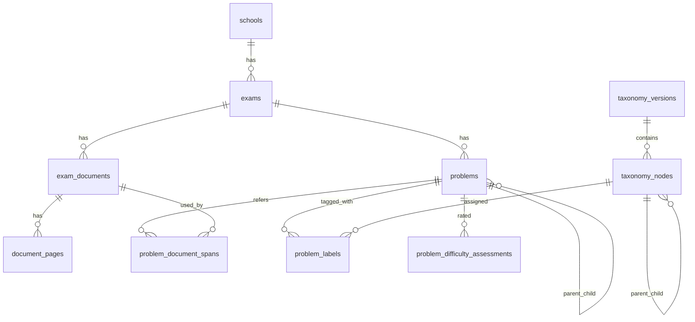

# 中学受験算数 問題分類 DB 設計

## 1. 目的

- OCR 済みの入試問題を、ページ単位ではなく問題単位で管理する。
- 各問題に対して、中学受験算数の分類ラベルを複数付与できるようにする。
- 難易度を 5 段階で保存し、後から見直せるようにする。
- 既存の `data/derived/page-text-index/*.jsonl` を活かしつつ、分類・検索・集計の基盤を DB に移す。

## 2. 結論

- 分類体系そのものは、`v1` として十分に使える。
- ただし、実運用では「1問1ラベル」ではなく「1問多ラベル」が前提になる。
- 最大の論点は、同じ木の中に `単元` と `典型題型` と `表現方法` が混在している点で、ここは DB と運用ルールで吸収するのが現実的。
- 難易度はラベルと分離し、別テーブルで履歴管理したほうがよい。
- 分類体系は将来必ず見直しが入るので、taxonomy 自体を version 管理するべき。

## 3. 分類体系レビュー

### 3.1 良い点

- A〜H の大分類は、中学受験算数の実務上かなり自然。
- `-99 その他` を各所に置いているので、初期運用で詰まりにくい。
- `E8 立体の相似`、`F1-8 余事象の利用` のような新設は妥当。
- `F2-3` と `G3-3` の区別を明示している点は良い。確率として扱うか、戦略ゲームとして扱うかを切り分けやすい。

### 3.2 そのままだと運用でぶつかる点

| 論点 | 現状 | 推奨ルール |
| --- | --- | --- |
| `A3-8` と `H3-1` | どちらも植木算的な数え上げに触れる | 主眼が「規則的な並びの項数え」なら `A3-8`、文章題として間隔と本数の対応を扱うなら `H3-1` |
| `B3-8 年齢算` と `H1` | 比で解く年齢算と和差で解く年齢算が混ざる | 主ラベルを `B3-8` に寄せつつ、和差が本質なら `H1-*` を副ラベルで併記 |
| `C4` と `E6-5` | どちらもグラフ読解を含む | 主ラベルは内容領域 (`速さ` / `水量変化`) に置き、`グラフ読解` は副ラベルにする |
| `D6` と `D7` | 図形移動と軌跡は実際には近い | 動かす操作が主なら `D6`、到達位置の集合を問うなら `D7` |
| `F1-7` と `G2-2` | どちらも包除原理を使う | 並べ方・作り方の数え上げなら `F1-7`、集合人数の整理なら `G2-2` |
| `F2-3` と `G3-3` | 同じ題材でも確率と必勝法が両立する | ランダム性が本質なら `F2-3`、先読み・戦略が本質なら `G3-3` |
| `H` 系全体 | `A/B/C/D/E/F/G` と直交する題型が多い | `H` は副ラベルとしても積極的に使う前提にする |

### 3.3 見直し推奨だが blocker ではない点

1. `A1-5 部分分数分解`
   中学受験算数としては名称がやや高校数学寄りです。実態が「分数を分解して計算を楽にする」なら、表示名は `分数の分解を使う計算` などに寄せたほうが運用しやすいです。
2. `H1-5 平均算`
   実務上はここでも困りませんが、件数が増えると独立の大分類にしたくなる可能性があります。
3. `-99 その他`
   初期運用には必要ですが、比率が高くなったら分類木を分割する運用ルールが要ります。

### 3.4 運用ルール

- 付与対象は原則として葉ノードだけにする。
- 1問につき `主ラベル 1件 + 副ラベル 0〜2件` を推奨する。
- 大問の中に独立した小問がある場合は、問題を親子に分ける。
- `-99 その他` は暫定避難先として使い、定期的に棚卸しする。
- 人手確定ラベルと LLM 推定ラベルは区別して保存する。

## 4. 難易度 5 段階の定義

難易度はラベルとは別軸です。ラベルに埋め込まず、別テーブルで評価します。

| 値 | 意味 |
| --- | --- |
| 1 | 基本。典型手順をそのまま使う。誤読が少なく、計算量も軽い |
| 2 | 標準。典型だが一段整理が必要。中堅校でよく出る |
| 3 | やや難。典型の組み合わせ、または条件整理に一工夫必要 |
| 4 | 難。発想の切り替えや複数分野の融合が必要。上位校で差がつく |
| 5 | 最難。最難関校で差がつく。複合性、見抜き、処理量のいずれかが重い |

補足:

- 基準は `中学受験算数の受験問題としての相対難度` に寄せる。
- 学校内相対ではなく、できるだけ横断比較できる基準にする。
- 評価者によるブレを抑えるため、`理由メモ` を残せるようにする。

## 5. 問題単位の定義

DB 設計では、`問題` を次のように定義します。

- 原則は「独立してラベルと難易度を付けたい最小単位」
- `問1` の中に `(1)(2)(3)` があり、それぞれ別テーマなら子問題に分割する
- 逆に 1 つのストーリーで連続して解く場合は、大問を 1 問として扱い、小問は必要に応じて子問題にする

このため、`problems.parent_problem_id` を持つ親子構造にします。

## 6. 推奨アーキテクチャ

現状の OCR パイプラインは、以下のファイル索引を持っています。

- `data/derived/page-text-index/pdfs.jsonl`
- `data/derived/page-text-index/pages.jsonl`

これを捨てずに、次の 2 層構造にするのが自然です。

1. OCR / ページ索引層
   既存の JSONL を生成し続ける
2. 問題分類 DB 層
   JSONL から `documents/pages` を取り込み、そこに `problems / labels / difficulty` を載せる

これなら OCR 側の既存資産を壊さずに拡張できます。

Laravel / React を使うなら、責務分担は次が自然です。

- Laravel
  DB スキーマ、migration、Eloquent model、管理 API、import batch、認証・権限
- React
  問題一覧テーブル、分類付与 UI、難易度レビュー UI、taxonomy 管理 UI

詳細は [math-taxonomy-laravel-react-architecture.md](/Users/yutazack/workspace/yotsuyaotsuka-pdf/docs/math-taxonomy-laravel-react-architecture.md) に分ける。

## 7. 概念モデル

## 8. 物理テーブル設計

### 8.1 `schools`

学校マスタ。

主な列:

- `school_id`
- `school_name`
- `prefecture`

### 8.2 `exams`

1 回の入試実体。`学校 + 年度 + 教科 + 回次` を表します。

主な列:

- `exam_id`
- `school_id`
- `exam_year`
- `subject`
- `exam_round`
- `source_system`

意図:

- `問題 PDF` と `回答 PDF` を同じ exam にぶら下げるため、document より一段上に exam を置きます。

### 8.3 `exam_documents`

問題 PDF / 回答 PDF / 解説 PDF などの実ファイル単位。

主な列:

- `document_id`
- `exam_id`
- `document_kind`
- `pdf_name`
- `source_pdf_path`
- `relative_source_pdf`
- `relative_image_dir`
- `full_text_path`
- `ocr_backend`
- `page_count`

意図:

- 既存の `data/derived/page-text-index/pdfs.jsonl` をそのまま取り込みやすい形にする

### 8.4 `document_pages`

OCR 後のページ単位データ。

主な列:

- `page_id`
- `document_id`
- `page_no`
- `image_path`
- `text_path`
- `ocr_json_path`
- `page_text`
- `char_count`
- `line_count`
- `avg_confidence`

意図:

- 現在の `pages.jsonl` 相当
- 問題切り出しの前段データとして使える

### 8.5 `taxonomy_versions`

分類体系の版管理。

主な列:

- `taxonomy_version_id`
- `version_code`
- `name`
- `status`

意図:

- 分類体系の修正時に、過去データとの互換を崩さない

### 8.6 `taxonomy_nodes`

分類ノード本体。自己参照で木構造を持たせます。

主な列:

- `taxonomy_node_id`
- `taxonomy_version_id`
- `parent_node_id`
- `code` 例: `B3-8`
- `name`
- `description`
- `level`
- `sort_key`
- `is_assignable`
- `is_other_bucket`
- `status`

設計方針:

- `code` は表示・運用上の自然キー
- 内部参照は `taxonomy_node_id`
- `is_assignable=1` は基本的に葉ノード

### 8.7 `problems`

問題本体。分類・難易度付与の中心テーブルです。

主な列:

- `problem_id`
- `exam_id`
- `parent_problem_id`
- `problem_code` 例: `1`, `1-2`, `大問3(2)`
- `sort_order`
- `display_title`
- `problem_text`
- `answer_text`
- `explanation_text`
- `status`
- `current_difficulty`
- `note`

設計方針:

- `problem_code` は人間向け
- `sort_order` は並び順制御
- `current_difficulty` は検索用キャッシュで、正本は難易度評価テーブルに置く

### 8.8 `problem_document_spans`

問題がどの document の何ページに対応するかを持つ中間テーブル。

主な列:

- `problem_document_span_id`
- `problem_id`
- `document_id`
- `span_role` (`question` / `answer` / `explanation`)
- `start_page`
- `end_page`
- `note`

意図:

- 問題文ページと解答ページを別 document にまたがって関連付けられる

### 8.9 `problem_labels`

問題と分類ラベルの多対多テーブル。

主な列:

- `problem_label_id`
- `problem_id`
- `taxonomy_node_id`
- `is_primary`
- `label_order`
- `source_type` (`human` / `llm` / `rule` / `imported`)
- `source_detail`
- `confidence`
- `rationale`

設計方針:

- 1問に複数ラベルを許可
- 主ラベルは 1 件だけに制約
- 人手確定前の LLM 推定値も保存可能

### 8.10 `problem_difficulty_assessments`

難易度評価の履歴テーブル。

主な列:

- `problem_difficulty_assessment_id`
- `problem_id`
- `scale_code`
- `difficulty_level`
- `source_type`
- `source_detail`
- `confidence`
- `rationale`
- `is_current`

設計方針:

- 難易度は見直しが入る前提なので、`problems` に 1 列だけ置かない
- 現在値だけを `is_current=1` で持つ

## 9. この設計で解けること

- `B3-8 年齢算` の問題だけを横断抽出する
- `D4-3 チョウチョ型` かつ難易度 4 以上の問題を集計する
- 同じ問題に `H1-2 つるかめ算` と `B2-5 比の差に注目する処理` を併記する
- 人手確定前の LLM ラベル候補を残し、後でレビューする
- 分類体系を `v2` に変えても、旧版データを保持する

## 10. 推奨インデックス

- `exams(school_id, exam_year, subject, exam_round)`
- `exam_documents(exam_id, document_kind)`
- `document_pages(document_id, page_no)`
- `problems(exam_id, sort_order)`
- `problem_labels(taxonomy_node_id, is_primary)`
- `problem_difficulty_assessments(problem_id, scale_code, is_current)`

補足:

- 全文検索を DB 側に寄せるなら SQLite FTS5 または PostgreSQL `tsvector` を別途追加する

## 11. データ投入フロー

1. `data/derived/page-text-index/pdfs.jsonl` から `exams / exam_documents` を作る
2. `data/derived/page-text-index/pages.jsonl` から `document_pages` を作る
3. 問題単位の切り出しを行い `problems` を登録する
4. 問題とページ範囲を `problem_document_spans` に登録する
5. ラベル候補と難易度候補を LLM / ルールで付与する
6. 人手レビュー後、`source_type=human` の確定値を更新する

## 12. 今回の分類体系に対する最終判断

結論として、分類体系は `DB 設計に載せてよい水準` です。  
ただし、問題があるのは分類木そのものというより、以下の 2 点です。

1. 単元と題型が混在しているため、単一ラベル前提では運用できない
2. 将来の分類見直しを前提に version 管理しないと破綻する

したがって、分類を作り直すより先に、DB 側を次の前提で設計するのが正解です。

- 多ラベル
- 主ラベル / 副ラベル
- 難易度は別管理
- taxonomy version 管理
- 人手確定値と機械推定値の分離

## 13. 実装メモ

- このプロジェクトの標準環境は `MySQL`。ローカルでは Docker Compose、配備先では一般的な PHP レンタルサーバーの MySQL を想定する
- Laravel のローカル簡易確認なら SQLite でも始められる
- PostgreSQL は VPS など自由度の高い環境に移るときの有力候補
- 具体的な DDL は [math-taxonomy-schema.sql](/Users/yutazack/workspace/yotsuyaotsuka-pdf/docs/math-taxonomy-schema.sql) に置く
- Laravel / React 前提の API と画面設計は [math-taxonomy-laravel-react-architecture.md](/Users/yutazack/workspace/yotsuyaotsuka-pdf/docs/math-taxonomy-laravel-react-architecture.md) に置く
